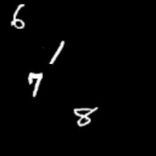
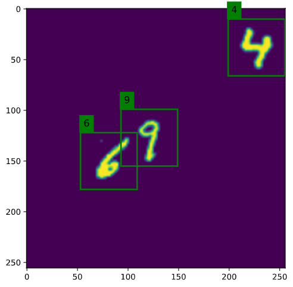

# Object detection Dataset Generator

## Features 
This repo's goal is to generate simple datasets to test object detection models.
In particular it allows to:
* Decide the image size
* Decide how many object to include in each image
  * Fixed number or maximum number, and randomly extract the number of objects for each image
  * Decide the type of objects to include in the image:
    * Classification datasets from `torchvision.dataset` like MNIST, FashionMNIST etc..
  * Decide the size of the objects to include in the image
  * export ground truths bbox in yolo unnormalized format

### TODO  
* Allow the use of different types of background
* Allow simple iamge transformations for included objects (eg: rotations..)
* Allow other export formats for annotations

## Samples

### MNIST

and with the their ground truth

